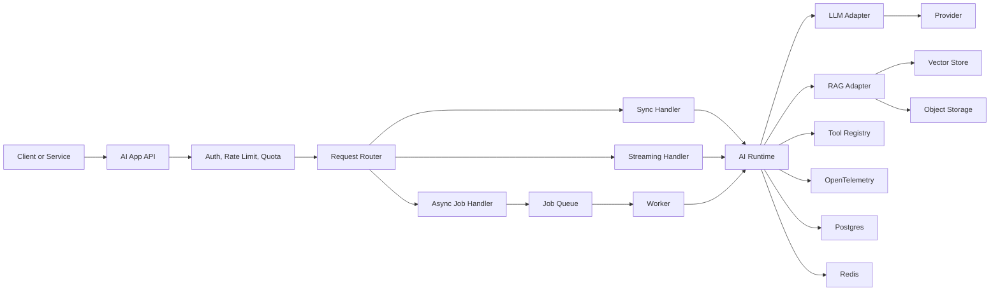

# AI Solution Engineering Platform Template Design

Date: 2026-05-20
Status: Superseded by 2026-05-20-simplified-runtime-and-db-session-design.md
Scope: Controlled rebuild of this repository into a team-shareable AI solution engineering platform template.

Current note: this document captures the initial broad spec. The current
accepted phase target is narrower: no template-owned adapter registry, no app
observability adapters yet, direct LangChain/LlamaIndex runtime usage, and
database access through SQLAlchemy `DbSession`.

## 1. Context

This repository started as a FastAPI backend template and has recently had business-specific modules removed. The current codebase still contains stale coupling from the old application, including old admin/task imports, JWT dependencies on removed user schemas, MySQL-oriented Alembic configuration, and Docker Compose naming from the previous project.

The target is not a business product. The target is a reusable platform template for AI solution engineers who need to research, evaluate, train, prototype, and then promote stable AI capabilities into a Dockerized backend service.

The template should support both experimentation and production-style serving, but the delivery boundary is Docker build/run. Deployment pipelines, cloud infrastructure, and organization-specific runtime platforms are outside this repository.

## 2. Goals

1. Provide a clean FastAPI application foundation for AI services.
2. Support ML research, training, evaluation, and artifact promotion through a `research/` workspace.
3. Support LLMOps concerns such as provider abstraction, prompt versioning, tracing, redaction, token/cost metrics, RAG, and optional agent orchestration.
4. Use adapters only at real integration boundaries, not as a general-purpose plugin framework.
5. Keep the default path runnable locally with Docker without requiring external cloud accounts.
6. Make the template useful for teams through clear contracts, fake adapters, contract tests, docs, and recipes.

## 3. Non-Goals

1. Do not build a full deployment pipeline.
2. Do not force a single observability backend.
3. Do not force LangGraph or any agent framework.
4. Do not implement a custom workflow engine.
5. Do not encode a business domain such as a knowledge assistant product.
6. Do not support every vendor from day one.
7. Do not make every internal service an adapter. Adapter boundaries should exist where replacement is likely and valuable.

## 4. Recommended Rebuild Strategy

Use a controlled rebuild inside the current repository.

Keep:

- Repository history.
- Useful FastAPI, logging, request ID, response, settings, Docker, DB, and Redis ideas where they can be made clean.
- Dependency management approach if still practical.

Replace:

- Old business-oriented `app.admin` and `app.task` references.
- Old JWT/user schema coupling.
- MySQL-oriented migration setup.
- Old Docker Compose service names and deployment-specific leftovers.
- Any module that cannot run as part of a generic template.

This is not a patch-style cleanup. It is a clean template rebuild that reuses good pieces deliberately.

## 5. High-Level Architecture

The platform has four top-level areas:

```text
app/          # Dockerized runtime application
research/     # Experiments, training, evaluation, datasets, artifacts
ops/          # Local/dev observability and runtime profiles
docs/         # Team playbooks, recipes, system design notes
```

The runtime application separates stable core concerns from replaceable integrations:

```text
app/
  core/
  contracts/
  adapters/
  modules/
  api/
  schemas/
  dependencies/
```

Core owns startup, configuration, lifecycle, health, errors, registry wiring, and baseline logging. Contracts define stable interfaces. Adapters implement vendor or infrastructure integrations. Modules implement reusable application capabilities such as identity, rate limiting, files, RAG, jobs, and evals.

## 6. Adapter and Registry Design

### Principle

Core owns contracts. Adapters own integrations. The registry wires selected capabilities at startup.

### Contract Technology

Adapter contracts should use Python `typing.Protocol`.

Use Pydantic for API payloads, persisted configuration schemas, and validation models. Do not use Pydantic models as the primary adapter interface. Use abstract base classes only when a contract needs shared base behavior, not as the default pattern.

Reasoning:

- `Protocol` keeps adapters structurally typed and easy to fake in tests.
- `Protocol` avoids forcing every adapter to inherit from a framework-owned base class.
- Pydantic remains the right tool for request/response and manifest validation.
- Choosing this upfront avoids rewriting adapters later.

### Registry Rule

The registry must not become a global service locator. Application services should receive dependencies through constructors or dependency injection.

Preferred:

```python
chat_model = registry.chat_model
knowledge_service = KnowledgeRetrievalService(embed_model=llamaindex_embed_model)
```

Avoid:

```python
registry.get("llm").chat(...)
```

### Adapter Boundaries

Adapters should exist for:

- Object storage.
- Job queue.
- Observability exporter or profile.
- Agent runtime.
- Experiment tracker.
- Artifact/model registry.
- LLM response cache.
- Auth strategy when projects need different auth modes.

Do not adapterize by default:

- LangChain chat models and embeddings.
- LlamaIndex RAG indexes, retrievers, and node parsers.
- Config/env loading.
- Error response shape.
- Request ID.
- Logging baseline.
- Health/readiness framework.
- Pydantic schemas.
- DB session and migration foundation.
- Basic user/API key tables.
- Rate limit domain model.
- File metadata model.
- RAG orchestration service.

### Vendor Type Rule

Vendor SDK clients must not leak across the app boundary. Ecosystem runtime
primitives are allowed inside AI modules when they are the chosen convention.
For example:

- Chat/agent modules may use LangChain `BaseChatModel`, messages, prompts, and
  runnables directly.
- RAG modules may use LlamaIndex `Document`, `VectorStoreIndex`, retrievers, and
  node parsers directly.
- Modules should still avoid raw provider clients such as `OpenAI`,
  `QdrantClient`, or SaaS-specific tracing clients unless isolated in a clearly
  named integration.

## 7. Proposed Folder Structure

```text
app/
  api/
    v1/
      auth/
      users/
      files/
      jobs/
      rag/
      evals/
      feedback/
      health/
  core/
    config.py
    registry.py
    lifecycle.py
    health.py
    errors.py
    logging.py
    security.py
    redaction.py
  contracts/
    llm.py
    embeddings.py
    vector_store.py
    storage.py
    jobs.py
    observability.py
    agents.py
    experiment_tracker.py
    artifacts.py
    llm_cache.py
  adapters/
    llm/
      fake.py
      openai_compatible.py
      openai.py
    embeddings/
      fake.py
      openai_compatible.py
    vector_store/
      in_memory.py
      pgvector.py
      qdrant.py
    storage/
      local.py
      s3.py
    jobs/
      in_process.py
      redis.py
      celery.py
    observability/
      otel.py
      debug.py
    llm_cache/
      noop.py
    agents/
      simple.py
      langgraph.py
      openai_agents.py
    mlops/
      local_tracker.py
      mlflow.py
  modules/
    identity/
    access_control/
    rate_limit/
    files/
    jobs/
    rag/
    evals/
    feedback/
  schemas/
  dependencies/
  bootstrap/

research/
  README.md
  datasets/
    samples/
    schemas/
  notebooks/
  experiments/
  training/
  evaluation/
    datasets/
    metrics/
    reports/
  prompts/
  traces/
  artifacts/
  scripts/

ops/
  observability/
    otel-collector.base.yaml
    otel-collector.debug.yaml
    otel-collector.grafana.yaml
    otel-collector.datadog.yaml
    otel-collector.phoenix.yaml
    docker-compose.grafana.yaml
    docker-compose.phoenix.yaml
    dashboards/

docs/
  architecture/
    system-design.md
    response-patterns.md
    adapter-guidelines.md
  recipes/
    use-openai-compatible.md
    use-ollama.md
    use-pgvector.md
    use-qdrant.md
    use-mlflow.md
    use-phoenix.md
    use-datadog.md
    use-langgraph.md
  mlops/
    promotion-guide.md
    eval-guidelines.md
  llmops/
    tracing-guidelines.md
    prompt-registry.md
    llm-response-caching.md
```

## 8. Default Local Stack

The default template should run locally without a cloud account.

Default adapters:

- LLM: fake or OpenAI-compatible.
- Embeddings: fake or OpenAI-compatible.
- Vector store: pgvector if Postgres extension is enabled, otherwise in-memory for tests.
- Storage: local filesystem.
- Jobs: in-process worker or Redis-backed job state.
- Observability: OpenTelemetry debug exporter.
- Agent runtime: simple runtime.
- Experiment tracker: local tracker.
- LLM response cache: no-op cache.

Optional profiles:

- Qdrant or Milvus vector store.
- S3-compatible object storage.
- Celery/RQ job queue.
- MLflow experiment tracking.
- Phoenix for AI tracing and evaluation.
- Grafana/Tempo/Prometheus/Loki for local OSS observability.
- Datadog via OTLP/exporter.
- LangGraph runtime.
- OpenAI Agents runtime.

## 9. APP Scope

The application is an AI backend foundation, not a product.

Required capabilities:

1. API key auth as the default auth mode.
2. Optional JWT/service-token auth strategy.
3. Identity module with users and API keys.
4. API key hashing, rotation, revocation, and metadata.
5. Role/permission hooks that are simple by default.
6. Redis-backed rate limit and quota hooks.
7. Postgres for metadata.
8. Redis for rate limit, cache, and job state.
9. Storage adapter for local files and optional S3-compatible storage.
10. Job abstraction with job table/status API.
11. File service with upload metadata, checksum, size limit, and content-type allowlist.
12. RAG capability as an optional module, not as a product.
13. LLM capability through provider contracts and adapters.
14. Agent runtime capability through contracts and optional adapters.
15. Health/readiness endpoints for API, Postgres, Redis, storage, queue, vector store, and LLM provider.
16. Request ID, structured logs, standard error envelope, pagination, timeout, and CORS defaults.
17. Secret redaction and safe config summary endpoints.
18. Feedback capture schema and endpoint for AI response quality signals.
19. Secret management workflow through `.env.example` and README guidance. No Vault or cloud secret manager adapter is required for the template.

Core capability endpoints should be generic:

- `POST /api/v1/files`
- `POST /api/v1/rag/index`
- `POST /api/v1/rag/search`
- `GET /api/v1/jobs/{job_id}`
- `POST /api/v1/feedback`

The feedback endpoint should capture schema-compatible data only. It should not implement analytics, retraining, labeling queues, or feedback-to-eval pipelines in the template.

Minimum feedback fields:

```text
request_id
trace_id
user_id or api_key_id
target_type: llm_response | retrieval_result | agent_run | eval_run
target_id
rating: positive | negative | neutral
labels: list[str]
comment: string | null
created_at
```

The RAG module should include:

```text
app/modules/rag/
  chunking.py
  ingestion.py
  embeddings.py
  retrievers.py
  reranking.py
  service.py
  schemas.py
```

## 10. MLOps Scope

The `research/` workspace supports experimentation and promotion, not deployment.

Required capabilities:

1. Dataset schema and sample dataset structure.
2. Training script template.
3. Evaluation dataset and metric structure.
4. Experiment output reports.
5. Local artifact tracking by default.
6. Optional MLflow integration.
7. Optional DVC metadata for data/artifact versioning.
8. Artifact manifest required before promotion to `app/`.
9. Eval smoke tests before Docker build.

Promotion manifest format:

```yaml
name: string
version: string
type: prompt | model | retriever | eval_dataset | agent
owner: string
created_at: string
input_schema: object
output_schema: object
runtime_dependencies:
  - string
eval_report: string
risk_notes:
  - string
artifact_uri: string
```

Promotion rule:

Research outputs can be used by the app only after they have a manifest, a defined runtime dependency list, and an eval report or documented smoke result.

## 11. LLMOps Scope

Required capabilities:

1. LLM provider contract.
2. Embedding provider contract.
3. Prompt registry with version, metadata, variables, and test cases.
4. Golden dataset support for LLM/RAG/agent evaluation.
5. Optional LLM-as-judge metric adapter.
6. OpenTelemetry spans around LLM calls, embedding calls, retrieval, reranking, tool calls, agent steps, and eval runs.
7. Token usage, model/provider, prompt version, latency, and estimated cost metadata.
8. Redaction default-on for prompts, inputs, outputs, tokens, API keys, and PII.
9. Guardrails/hooks for max input tokens, max output tokens, timeout, and safety blocks.
10. Regression suite for prompt/RAG/agent changes before promotion.
11. LLM response caching contract as a cross-cutting capability across all LLM calls.

The LLM response cache must be represented as a contract with a no-op default adapter. The template should not implement a concrete cache policy in the first rebuild.

Cache contract requirements:

- Accept a normalized cache key input that can include model, provider, prompt version, messages, tools, generation parameters, tenant/user scope, and safety-relevant settings.
- Return cache hit metadata without exposing vendor-specific response types.
- Allow callers to bypass caching per request.
- Make caching opt-in by configuration and default to no-op.
- Avoid caching streamed partial output unless a future adapter explicitly supports final-response materialization.

Trace content mode:

```text
TRACE_CONTENT=off | redacted | full
```

Default: `redacted`.

## 12. Agent Runtime Scope

The default runtime is simple and framework-light.

Agent runtimes:

- `simple`: default single-agent or tool-calling loop.
- `langgraph`: optional adapter for stateful graph workflows.
- `openai_agents`: optional adapter for OpenAI Agents SDK workflows.

Use LangGraph only when the workflow needs one or more of:

- Explicit multi-step graph control.
- Supervisor/subagent orchestration.
- Durable checkpoint/resume.
- Human-in-the-loop interruption.
- Long-running stateful execution.
- Parallel or conditional agent branches.

Do not require LangGraph for simple LLM calls or a small number of direct tools.
Knowledge retrieval can stay a tool until the product workflow needs graph state.

## 13. Observability Design

Application code emits OpenTelemetry telemetry. Observability backends are infrastructure profiles.

Profiles:

- `debug`: local debug exporter/log output.
- `grafana`: OTLP to OTel Collector/Grafana stack.
- `datadog`: OTLP to Datadog Agent/exporter.
- `phoenix`: OTLP/OpenInference-friendly profile for AI tracing and eval workflows.
- `custom`: team-owned collector config.

Application code must not import Datadog, Grafana, Langfuse, or Phoenix SDKs in business modules. Vendor-specific behavior belongs in adapters or ops profile configuration.

AI span attributes should include:

- `ai.provider`
- `ai.model`
- `ai.operation`
- `ai.prompt.version`
- `ai.tokens.input`
- `ai.tokens.output`
- `ai.cost.estimated`
- `ai.retrieval.top_k`
- `ai.retrieval.collection`
- `ai.eval.dataset`
- `ai.eval.score`
- `app.request_id`
- `app.job_id`
- `app.user_id`

## 14. AI Service Response Patterns

LLM services have different response characteristics from normal CRUD services. The template should support three response modes.

### Sync

Use for short tasks.

```http
POST /api/v1/llm/generate
```

Response:

```json
{
  "request_id": "req_...",
  "trace_id": "trace_...",
  "status": "completed",
  "data": {},
  "usage": {
    "provider": "openai-compatible",
    "model": "model-name",
    "input_tokens": 0,
    "output_tokens": 0,
    "latency_ms": 0,
    "estimated_cost": 0
  }
}
```

### Streaming

Use for chat, agent UX, or progressive generation.

```http
POST /api/v1/llm/stream
```

Transport: Server-Sent Events.

Events:

- `token`
- `tool_call`
- `trace`
- `final`
- `error`

### Async Job

Use for ingestion, evaluation, batch scoring, training, and long agent workflows.

```http
POST /api/v1/jobs
```

Response:

```json
{
  "request_id": "req_...",
  "trace_id": "trace_...",
  "job_id": "job_...",
  "status": "queued"
}
```

Status endpoint:

```http
GET /api/v1/jobs/{job_id}
```

Response:

```json
{
  "job_id": "job_...",
  "status": "queued | running | completed | failed | cancelled",
  "progress": {
    "current": 0,
    "total": 0,
    "message": "string"
  },
  "result": {},
  "error": null,
  "trace_id": "trace_..."
}
```

Required request metadata:

- `request_id`
- `trace_id`
- `job_id` when async
- `idempotency_key` for retry-safe client behavior

## 15. Microservice Design Guidance

Do not split the template into multiple microservices by default. Implement one modular Dockerized service and document how teams can split later.

Recommended pattern for downstream services:

1. Use sync only for bounded, short AI operations.
2. Use streaming for user-facing chat/agent flows.
3. Use async jobs for long-running work.
4. Use idempotency keys so retries do not create duplicate LLM calls or duplicate cost.
5. Persist results and status so callers can poll or subscribe.
6. Avoid making unrelated business services synchronously depend on long LLM calls in critical paths.

Reference architecture:



## 16. Reliability and Safety Policies

Required policies:

1. Timeout per provider call.
2. Retry only for safe transport errors.
3. Do not blindly retry generation after partial output has started.
4. Support cancellation for streams and jobs.
5. Track usage per request and job.
6. Estimate cost where provider metadata allows it.
7. Enforce upload size and content-type limits.
8. Redact secrets in logs, traces, health, and config summaries.
9. Expose clear provider/config validation errors at startup.
10. Return typed errors for provider timeout, provider rate limit, invalid output, retrieval failure, tool failure, safety block, and quota exceeded.

## 17. Testing Strategy

Testing layers:

1. Unit tests for core and modules.
2. Contract tests for each adapter category.
3. Fake/in-memory adapter tests without external services.
4. Integration smoke tests for Postgres and Redis.
5. RAG smoke test using fake or local embedding/vector store.
6. LLM mock test for provider contract behavior.
7. Eval smoke test for research-to-app promotion.
8. Docker smoke test for build and container startup.

Every adapter should pass a shared contract test suite where possible. For example, each vector store adapter should pass insert, search, metadata filter, delete, and health checks.

## 18. Golden Path Commands

The repository should support these commands:

```text
make dev
make test
make eval-smoke
make docker-build
make docker-run
```

If Make is not used, equivalent scripts must exist and be documented.

The golden path should demonstrate:

1. API key auth.
2. Health/readiness.
3. Fake or OpenAI-compatible LLM call.
4. RAG search using local/default dependencies.
5. Trace output through debug OpenTelemetry.
6. Eval smoke result.
7. Docker image build and startup.

## 19. Documentation Requirements

Required docs:

- `README.md`: quickstart, architecture summary, command list.
- `docs/architecture/system-design.md`: AI service architecture and response patterns.
- `docs/architecture/adapter-guidelines.md`: adapter and registry rules.
- `docs/mlops/promotion-guide.md`: research-to-runtime promotion.
- `docs/mlops/eval-guidelines.md`: dataset, metrics, reports.
- `docs/llmops/tracing-guidelines.md`: tracing, redaction, usage metadata.
- `docs/llmops/llm-response-caching.md`: cache contract, no-op default, and cautions for streamed responses.
- `docs/recipes/`: focused recipes for common integrations.

Recipes should be preferred over building a platform UI.

Secret handling requirement:

- `.env.example` must list required variables with safe example values.
- `README.md` must state that secrets are injected through environment variables and should not be committed.
- No Vault, cloud secret manager, or organization-specific secret workflow is included by default.

## 20. Implementation Phases

### Phase 1: Clean Foundation

- Remove stale business imports and modules.
- Create clean app structure.
- Fix settings/env model.
- Fix Postgres/Alembic setup.
- Normalize Dockerfile and local Compose.
- Add health/readiness.
- Add request ID, logging, error envelope.
- Add API key auth and basic rate limit.
- Add `.env.example` and README secret handling guidance.
- Add feedback capture schema and endpoint.

### Phase 2: Contracts and Default Adapters

- Add contracts.
- Add registry and startup wiring.
- Add fake/local adapters.
- Define `typing.Protocol` as the adapter contract standard.
- Add OpenAI-compatible LLM and embedding adapters.
- Add LLM response cache contract with no-op default adapter.
- Add local storage.
- Add in-process job adapter.
- Add debug OpenTelemetry adapter/profile.
- Add adapter contract tests.

### Phase 3: AI Capabilities

- Add prompt registry.
- Add RAG module.
- Add eval module.
- Add usage/cost/latency tracking.
- Add redaction policy.
- Add simple agent runtime.
- Add optional LangGraph adapter.

### Phase 4: Research and MLOps

- Add `research/` workspace.
- Add dataset and artifact manifest structure.
- Add training/eval script templates.
- Add local experiment tracker.
- Add optional MLflow profile.
- Add eval smoke command.

### Phase 5: Team Readiness

- Add docs and recipes.
- Add Docker smoke.
- Add system design docs.
- Add contribution guidance for new adapters.
- Add template hygiene checks.

## 21. Acceptance Criteria

The template is ready when:

1. A new developer can run the golden path locally.
2. The app starts without references to removed business modules.
3. Docker build and run work.
4. Postgres and Redis health checks work.
5. API key auth and rate limiting work.
6. At least one LLM adapter and one fake LLM adapter pass contract tests.
7. At least one vector store adapter and one fake/in-memory vector store pass contract tests.
8. RAG smoke test works without a cloud account.
9. Eval smoke test works against sample data.
10. OpenTelemetry debug profile emits trace/log information.
11. Docs explain how to swap key adapters.
12. LLM response cache contract exists and defaults to no-op.
13. Feedback capture endpoint and schema exist without a downstream pipeline.
14. `.env.example` and README document secret handling.
15. Adapter contracts consistently use `typing.Protocol`.
16. No cloud vendor or observability vendor is required for the default path.

## 22. Reference Sources

- OpenTelemetry Collector architecture: https://opentelemetry.io/docs/collector/
- OpenTelemetry Python: https://opentelemetry.io/docs/languages/python/
- MLflow evaluation: https://mlflow.org/docs/latest/ml/evaluation/
- DVC user guide: https://dvc.org/doc/user-guide/what-is-dvc
- LangGraph overview: https://docs.langchain.com/oss/python/langgraph
- LangChain multi-agent patterns: https://docs.langchain.com/oss/python/langchain/multi-agent/index
- OpenAI Agents SDK: https://developers.openai.com/api/docs/guides/agents
- OpenAI Agents tracing: https://openai.github.io/openai-agents-python/tracing/
- Arize Phoenix: https://arize.com/docs/phoenix
